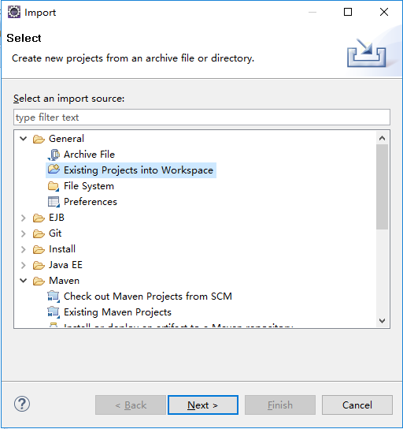
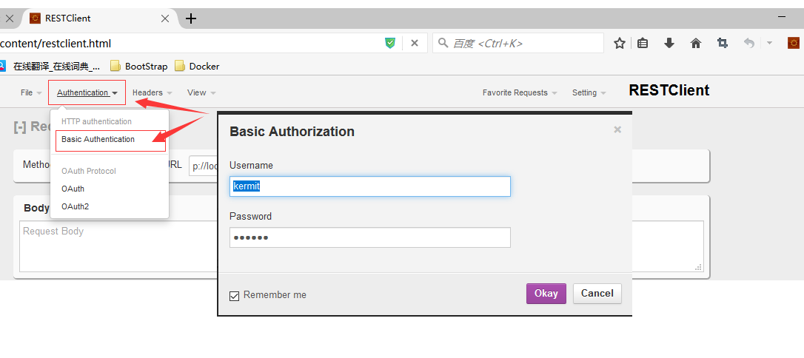
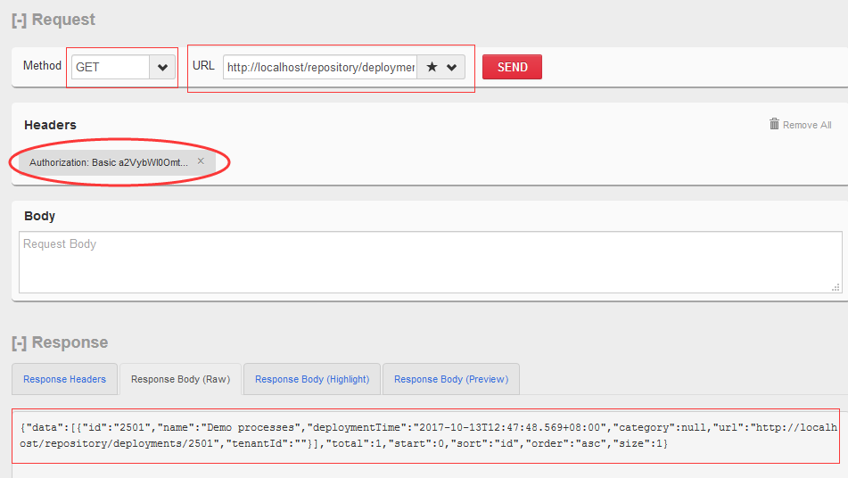

# activiti-rest-6.0-spring-boot

这个项目采用了activiti 6.0 release版官方提供的activiti-rest 接口包,  并用spring-boot进行封装, 最终的到了一个可以独立运行的微服务.

Setup Development Environment
--
* 在项目根目录下执行
```
gradlew  eclipse
```
* 从Eclipse里面导入工程




Deploy
--
* 在项目根目录下执行
```
gradlew clean build
```
* 执行build/libs/*.jar文件
```
java -jar activiti-rest-6.0.jar
```

Test
--

访问入口示例:

[http://localhost/repository/deployments](http://localhost/repository/deployments)

API Document:

[Swagger UI 文档](doc/API.md)
 
https://www.activiti.org/userguide/6.latest/#_rest_api
 

采用 Basic Authentication

测试用户名/密码:

<table width="100%">
<tr><th>login Name</th><th>Username</th> <th> Email </th><th> Password</th></tr>
<tr><td>fozzie</td><td>Fozzie Bear	    </td><td>fozzie@activiti.org </td><td> fozzie	</td></tr>
<tr><td>gonzo</td> <td>Gonzo The Great	</td><td>gonzo@activiti.org	 </td><td>gonzo	</td></tr>
<tr><td>kermit</td><td>Kermit The Frog	</td><td>kermit@activiti.org </td><td> kermit	</td></tr>
</table>

- Firefox插件 RestClient 示例:

如下图, 在 "Authentication" 选项菜单里面选 "Basic Authentication" . 在弹出的录入框里面填写上面表格里面提到的3个用户的任意一个即可.



填写好后,点击确定, 你可以在下图中间Header部分看到验证信息已经生效.

选择HTTP Rest请求的类型GET, 然后填写API的url: http://localhost/repository/deployments , 点击"Send", 就可以在下面看到返回的json数据. 

